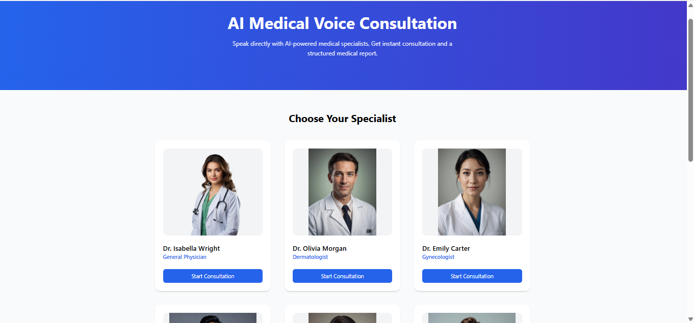
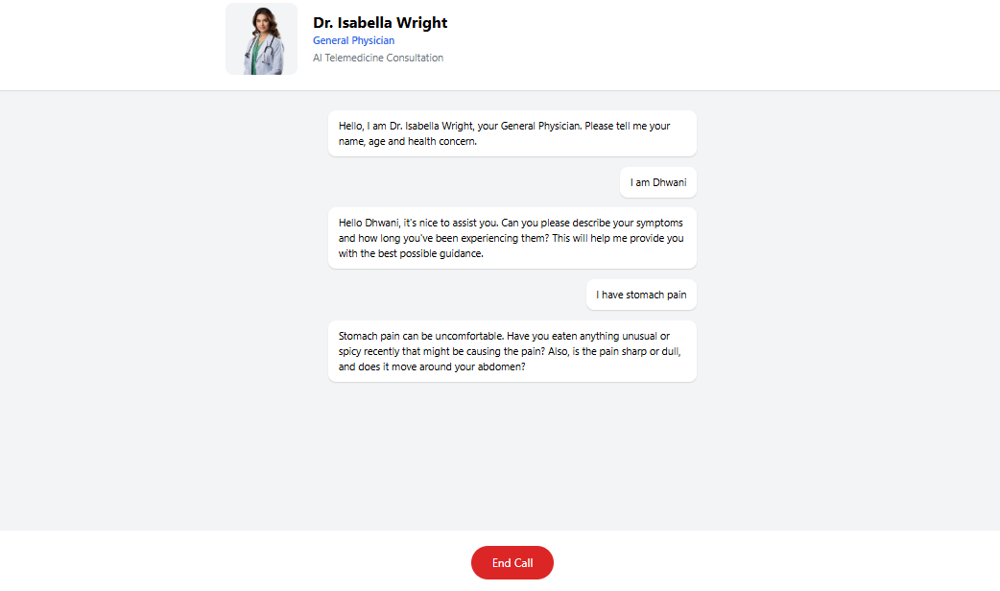
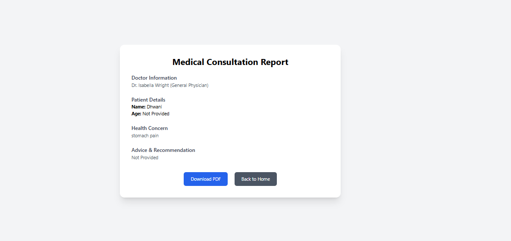

# AI Medical Voice Agent

## Overview
AI Medical Voice Agent is a voice-enabled web application that allows users to interact with an AI system for basic medical guidance. 
It converts speech into text, processes it using an AI model, and responds with voice output in real time.

---

## Features
* Speech-to-Text using **Web Speech API (browser-based)**
* Text-to-Speech using **Deepgram API**
* AI-powered responses using **Hugging Face (LLaMA 3 model)**
* Real-time voice interaction
* Automatic medical report generation

---

## Tech Stack

* **Frontend:** React.js, Tailwind CSS
* **Backend:** Node.js, Express.js
* **APIs:**
  * Hugging Face Router (LLaMA 3 - chat & report generation)
  * Deepgram API (Text-to-Speech)
* **Browser API:** Web Speech API (Speech Recognition)

---

##  Screenshots

---

## Live Demo

* https://amvaf.onrender.com/

---

##  Installation & Setup

# Clone the repository
git clone https://github.com/dhwani1006/AI-Medical-Voice-Agent.git

# Install dependencies
npm install

# Run backend
cd backend
npm start

# Run frontend
cd frontend
npm start

---

## How It Works

1. User speaks through microphone (Web Speech API)
2. Speech is converted into text
3. Text is sent to Hugging Face AI model
4. AI generates a response
5. Response is converted to speech using Deepgram
6. Audio is played back to the user
7. Structured medical report is generated

---

